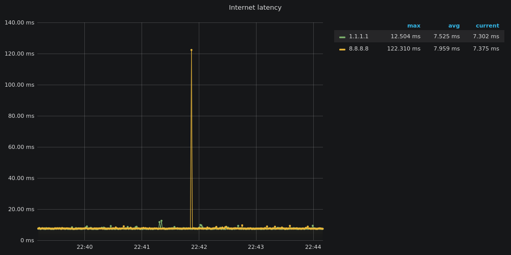

# Grafana Latency Monitor

A simple Grafana dashboard to monitor the health and latency of your Internet connection.

You can deploy it on a server in your local network (a Raspberry Pi or a NAS for example) and use it to send screenshot to your ISP if your connection is not working properly.

## Why not [SmokePing](https://oss.oetiker.ch/smokeping/) ?

With Grafana you are able to explore network activity in custom time ranges, Grafana graphs are sexier and Covid-19 boredom is killing me.

## Requirements

[Docker](https://docs.docker.com/engine/install/) and [Docker Compose](https://docs.docker.com/compose/install/)

## Usage

1.  change all the CHANGEME in docker-compose.yml for your needs
2.  `docker-compose up -d`
3.  visit http://localhost:3000 and login with username "admin" and the password provided in step 1.
4.  Dashboards > Manage > PING
5.  enjoy
